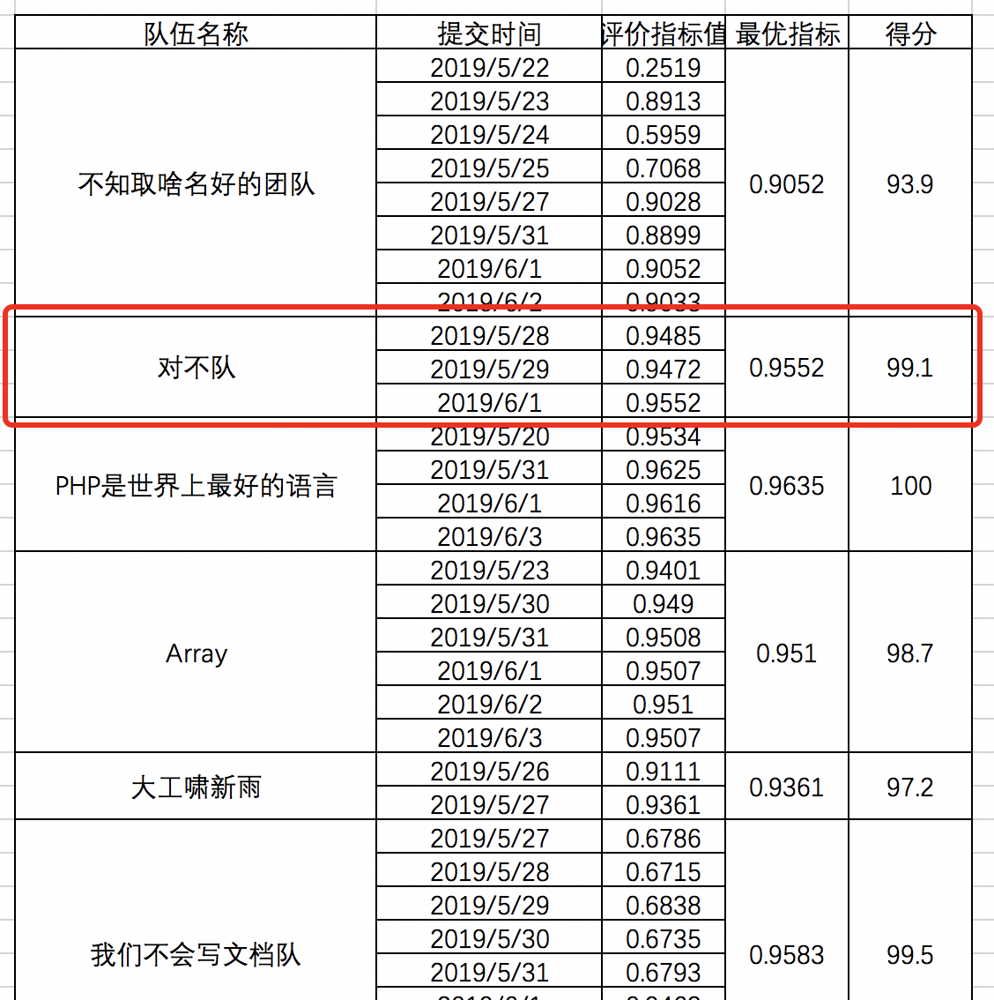

# 大数据智能量刑

## 任务与数据描述

给出案件案情数据（案情事实、目标嫌疑人、涉及的法律条文），建立模型预测新案件的罪名。

数据集字段描述如下，其中测试集没有accusation字段，需要建立模型预测。accusation所表示的罪名空间共有30个罪名，每一个案件可以有一个或多个罪名。最终评价指标用每个罪名标签的宏F1与微F1的平均值给出。

字段|含义|格式
---|---|---
ids|案件id信息，由案件正文内容计算hash得到|str
fact|案件对应的案情事实	|str
criminal|需要进行罪名预测和法律条文预测的目标嫌疑人|str
accusation|指控信息，即嫌疑人涉及的罪名信息|str
articles|嫌疑人涉及到的法律条文编号|str

## 思路

问题归类：NLP+多标签预测问题。

- 首先，

## 结果

[最终成绩为0.9552，在所有队伍中排名top2(2/20)。](http://bigdata.dlut.edu.cn/info/1002/1116.htm)

## 文件说明

执行顺序

- databuild.py：提取特征
- gridsearch.py：网格搜索
- train.py：模型训练
- predict.py：预测

辅助文件

- config.py：配置文件
- functions.py：函数文件

